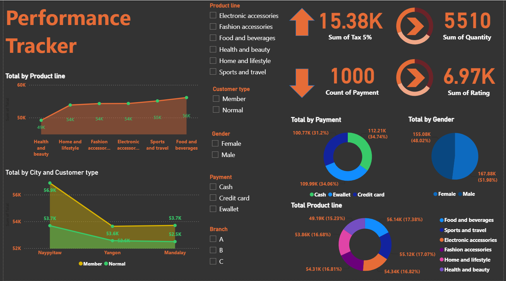

# 📊 Performance Tracker Dashboard

An interactive **Power BI dashboard** designed to analyze sales performance across product lines, customer types, genders, payment methods, branches, and cities.

The dashboard transforms transactional data into an easy-to-understand visual report that helps identify sales trends, customer behavior, product performance, and payment patterns.

## 🚀 Dashboard Preview



> Replace `dashboard.png` with the actual filename of your uploaded dashboard image in the repository.

---

## 📌 Key Features

* 📈 Total sales analysis by product line
* 🛍️ Product-line performance comparison
* 👥 Customer type analysis — Member vs Normal
* 🚻 Gender-based sales analysis
* 💳 Payment method analysis
* 🏢 Branch-wise performance
* 🌍 City-wise customer analysis
* ⭐ Customer rating analysis
* 💰 Tax and quantity KPIs
* 🔎 Interactive filters for:

  * Product Line
  * Customer Type
  * Gender
  * Payment Method
  * Branch

---

## 📊 Key Dashboard Metrics

| KPI                |  Value |
| ------------------ | -----: |
| Total Tax (5%)     | 15.38K |
| Total Quantity     |  5,510 |
| Number of Payments |  1,000 |
| Total Rating       |  6.97K |

---

## 📈 Visualizations Included

### Total by Product Line

Displays the total sales performance across:

* Health and Beauty
* Home and Lifestyle
* Fashion Accessories
* Electronic Accessories
* Sports and Travel
* Food and Beverages

### Total by City and Customer Type

Compares customer spending across major cities and customer categories:

* Naypyitaw
* Yangon
* Mandalay
* Member
* Normal

### Payment Analysis

Shows the distribution of transactions across:

* Cash
* E-wallet
* Credit Card

### Gender Analysis

Provides a comparison of sales contribution between:

* Female customers
* Male customers

### Product Line Distribution

A donut chart provides a percentage-based comparison of total sales across different product categories.

---

## 🛠️ Tools & Technologies

* **Microsoft Power BI**
* **Power Query**
* **DAX**
* **Data Visualization**
* **Data Cleaning & Transformation**
* **Business Intelligence**
* **Data Analytics**

---

## 🔄 Data Analysis Workflow

```text
Raw Transaction Data
        ↓
Data Cleaning
        ↓
Data Transformation
        ↓
Data Modeling
        ↓
DAX Measures
        ↓
Interactive Visualizations
        ↓
Business Insights
```

---

## 🎯 Business Objectives

The dashboard was developed to answer questions such as:

1. Which product lines generate the highest sales?
2. Which cities contribute the most revenue?
3. How do Member and Normal customers differ?
4. Which payment method is most commonly used?
5. How are sales distributed between male and female customers?
6. Which product categories require greater business attention?
7. What are the overall quantity, rating, and tax metrics?

---

## 💡 Key Insights

The dashboard provides a consolidated view of business performance and enables users to quickly compare:

* Product category performance
* Customer purchasing behavior
* Payment preferences
* Geographic performance
* Customer demographics
* Overall sales and transaction KPIs

These insights can support **sales planning, customer segmentation, product strategy, and business decision-making**.

---

## 📂 Project Structure

```text
Performance-Tracker/
│
├── Dashboard/
│   └── Performance_Tracker.pbix
│
├── Screenshots/
│   └── dashboard.png
│
├── Data/
│   └── dataset.csv
│
└── README.md
```

> Update the filenames/folders to match your actual GitHub repository.

---

## ▶️ How to Use

1. Download or clone this repository.

```bash
git clone https://github.com/your-username/Performance-Tracker.git
```

2. Open the `.pbix` file using **Microsoft Power BI Desktop**.

3. If the dataset is included, update the data source path if required.

4. Refresh the data.

5. Use the dashboard filters to explore different business segments.

---

## 📷 Dashboard Highlights

The dashboard includes KPI cards, line/area charts, donut charts, interactive slicers, and category-level comparisons to provide a comprehensive business performance overview.

---

## 👨‍💻 Skills Demonstrated

* Data Analysis
* Business Intelligence
* Power BI Dashboard Development
* DAX
* Data Cleaning
* Data Transformation
* Data Visualization
* KPI Development
* Customer Analytics
* Sales Analytics
* Business Reporting

---

## 📌 Project Type

**Business Intelligence | Data Analytics | Power BI**

---

## ⭐ Future Improvements

* Add monthly/yearly sales trends
* Add profit and margin analysis
* Add sales forecasting
* Add customer segmentation
* Add drill-through pages
* Add automated data refresh
* Publish the dashboard to Power BI Service

---

## 👤 Author

**Sri Harish**

Computer Science Engineer | Data Analyst | Business Intelligence Developer | AI & ML Enthusiast

* LinkedIn: [(https://www.linkedin.com/in/sri-harish-2b34a930a)](https://www.linkedin.com/in/sri-harish-03219432b/)

---

⭐ If you found this project useful, consider giving the repository a star!
